# Самодельный стратостат. Часть 2


Long, long time ago... Нет, не так. 4 месяца назад я рассказал вам, как из клея и резиновых сапог создать с нуля свой стратостат с телеметрическим модулем и видеокамерой. Я так же описал наш опыт запуска и поиска этого метеозонда, обозначив несколько возникших проблем. Что ж. Мы анализировали, анализировали и доанализировались до четвертого шара. И сейчас я расскажу вам, что произошло за это время, почему он четвертый, и где *пропавшие* два. Эта часть будет менее технической, т.к. изменений конструкции *почти* не было, но те что были - имеют значение. Если вы вне контекста, то эту часть советую читать только после прочтения первой (хотя бы технических разделов). Ссылка на первую часть ниже. Будет много фото, видео и графиков. Поехали?

## Вступление

[Самодельный стратостат. Часть 1](https://habr.com/ru/post/555070/)

Кратко напомню, что тут происходит и что будет происходить дальше. Давненько уже (больше года назад) задумали мы с друзьями собрать с нуля и запустить (а потом и найти/достать) свой стратостат. Полных инструкций в интеренете оказалось не много, по-этому появилась первая часть этой статьи. Как и любой проект - этот проект должен иметь финал. А чтобы иметь финал - нужно иметь конкретные цели проекта. Из целей были выделены две: достичь высоты 30км и получить видео в 4k с высоты 30км. Ни одна из целей не была достигнута в первом запуске (напомню, там было: 19км и видео до 7км), так что проект продолжил развиваться.

Давайте сначала я опишу *naming convention*, чтобы не путаться дальше в истории. Я разделяю 2 сущности: запуск и шар. Сделано это потому, что в один запуск мы можем запустить (поправить бы тавтологию) несколько шаров. А нам нужна адресация до конктретного запуска-шара. Итак. Первый наш шар носил название **Vostok-1** - первый запуск, единственный шар. За ним был **Vostok-2** - второй запуск, единственный шар. Далее **Vostok-3a и Vostok-3b** - 3й запуск, два шара. Vostok-2 и Vostok-3a потерпели крушение на старте.

### Vostok-2

Первой нашей проблемой была высота. И с ней так же связан неудачный запуск второго шара. Высоту мы решили победить увеличением объема шара. Был выбран шар **L-800** (800 это масса шара в граммах, таблица ниже). А если больше шар, то и гелия надо больше, правильно? Правильно. Но мы совершили ужасную ошибку и тут и с Vostok-1: за целевой объем шара мы приняли не ту величину. Мы их сильно перекачивали. Vostok-1 улетел чудом, Vostok-2 не выдержал такого издевательства и *сошел с рельс* на старте. Давайте разберемся где я накосячил в оба запуска.


Вот технические характеристики шаров. Vostok-1 имел шар **L-300**. Вроде все ясно, только одно мне было не ясно: в чем разница между *начальным* и *рабочим* диаметрами. Я, почему-то, подумал, что если есть слово "гелий" - значит нам туда. Оказалось, что нет. Рабочий диаметр, это некое усредненное значение *на высоте*. А нам надо было использовать начальный диаметр как цель для наших расчетов. Давайте посчитаем количество гелия для этих шаров и разных диаметров по формуле из первой статьи:

| Шар | Начальный диаметр (баллонов по 40л) | Рабочий диаметр (баллонов по 40л) |
|-----|-------------------|-----------------|
| L-300 | 0.29 | 0.70 |
| L-800 | 1.72 | 3.43 |

В обоих случаях разница значительная. Уже на старте мы перекачали шар почти вдвое! Но, т.к. мы докачивали шар до его рабочего диаметра - он не взрывался (этот же диаметр - рабочий!). Проблема оказалась в подъемной силе. Во втором случае она очень, очень значительная. Пока ребята накачивали его, им пришлось буквально висеть на нем вдвоем и третий подстраховывал. Это создало значительную нагрузку на горловину шара, за которую его и держали. И, невыдержав растяжения, горловина порвалась, унеся в небо 50000 рублей. От такого количества гелия местные птицы еще 3 дня орали смешным голосом.

[](https://youtu.be/PQXxAPXEx18 "Vostok-2 Fail")

Итак, осознав свою ошибку, мы получили серьезное преимущество - теперь мы знали, что гелия нам надо вдвое меньше. А гелий и, непосредственно, шар - это единственные невозвратные ресурсы наших запусков. Иначе говоря - мы сильно снизили стоимость запуска.

### Vostok-3a

Это был шар L-600. Мы закачали правильное количество гелия. И даже немного подстраховались (как мы тогда думали), используя тент для удержания шара в процессе накачки, чтобы не создавать нагрузку на горловину. Подвела нас анатомическая аномалия всех членов команды (проще говоря - руки из ж...). И этот шар успешно улетел в ветки деревьев, об которые и взорвался.

[](https://youtu.be/dokYBQEhyGc "Vostok-3a Fail")

Выдержав минуту молчания, мы вспомнили, что когда-то давно то мы заказывали 2 шара L-300. Как раз на случай неудачи. И сейчас был именно такой случай. Так как гелия мы всегда берем немного с запасом (мало ли стравит где или еще чего), то немного у нас еще оставалось. Да и шар этот был почти вдвое меньше, так что и гелия надо было сильно меньше. Закачав остатки в 300-й шар мы, уже особо ни на что не расчитывая, просто отпустили его в небо без долгих прощаний. Это был наш **Vostok-3b**. Об этом запуске и пойдет речь в этой статье, т.к. он оказался успешным!

## Список оборудования и компонентов

На самом деле, оборудования, в сумме, докупалось прилично. Но тут я не буду перечислять все купленное, а сосредоточусь только на том, что реально улетело на Vostok-3b.

> Некоторые разделы будут выглядеть как: ничего не изменилось, идем дальше. Я оставил структуру статьи как в первой части *для обратной совместимости*

Состав полезной нагрузки почти не подвергся изменениям: это все та же RPI 4B (+Sense HAT + GPS HAT) + GoPro 7 black.

Добавлю только пару фото компонентов черного ящика (ранее их не было), так как я забирал его домой для ремонта, который не пригодился, но об этом упомяну чуть детальней далее по тексту:


Помимо увеличения объема шара, для достижения расчетной высоты мы решили так же экономить и вес полезной нагрузки. Проанализировав массу компонентов, мы поняли, что можем хорошо сэкономить на аккумуляторах (павербанках). В первый запуск это было 2 павербанка по 20000 mAh, каждый массой ~300г. Взглянув на телеметрию Vostok-1, мы поняли, что бОльшую часть времени наш зонд работал на земле, соответственно таких емкостей (как минимум для RPI) - нам не надо. И решили порезать емкость банок вдвое. Обеих. Взяли 2 павербанка 10000 mah с массой 180г каждый. И не прогадали, экономия массы ощутимая, емкости хватило на обе подсистемы и даже немного с запасом.

Ну и мы не стали в этот раз класть бутылку виски :)

По оборудованию это все. Переходим к облегчению конструкции.

## Конструкция

Далее мы решили переделать корпус. Корпус первого востока был слишком большой для наших нужд и это было нерационально - пенополистерол тоже имеет вес. Мы так же пробовали различные материалы, в частности, пенопласт.


Но, несмотря на значительную экономию массы - пенопласт не подходил по ряду причин. Например, он был слишком хрупким и мог развалиться от нагрузки создаваемой подъемной силой шара. В итоге мы откатились до пенополистирола, но срезали ему лишнюю *крышу*:


Размеры нового бокса:


### Общая конструкция

Схема та же, что и с Vostok-1. Единственное что мы добавили (по совету из комментариев на YouTube) - боковые стабилизаторы. Помогли они или нет - сложно судить. Забегая вперед скажу: судя по телеметрии и даже видео - да, крутило меньше чем в первый раз. Но и условия полета были другие. Так что тут мне сложно судить о целесообразности этого решения в нашей задаче. И, несмотря на то, что стабилизаторы увеличат массу - мы все же решили рискнуть и приклеили пластиковые треугольники по бокам:


Это вид бокса уже после того, как мы его нашли (и сняли верхнюю крышку). Фотки *до* я, почему-то, не смог найти. Но суть стабилизаторов это передает.

Да, и, как видите - GoPro на этот раз мы решили закрепить целиком снаружи на пластиковые стяжки, продетые сквозь корпус. Во избежание перегрева в стенках бокса.

### Полезная нагрузка

Как я уже упоминал, заменили только павербанки. Так же, решили немного перекомпоновать компоненты в соответствии с новыми размерами бокса. Но смысл остался тот же: внизу грелка (RPI), над ней аккумуляторы обогреваемые RPI, по бокам сопла для поступления забортного воздуха для охлаждения RPI. Эти сопла так же используются для крепления бокса к парашютному фалу. Не буду вставлять схему охлаждения, т.к. это точно та же система, что и в Vostok-1. Она хорошо себя показала в тот запуск и мы решили ничего не ломать:


Приклеили так же несколько пенопластовых балок для фиксации компонентов нагрузки:


Итак. Что же нам это дало? Напомню, что Vostok-1 имел массу полезной нагрузки **2.5кг**. После проведенных манипуляций, нам удалось снизить ее вдвое - **1375г**:


Посчитав себя хорошими мальчиками, мы закончили с нагрузкой и двинулись дальше.

## Программирование

Ничего не менялось перед полетом. Все [тот же софт на dotnet](https://github.com/ArtemKiyashko/RpiProbeLogger) полетел, прилетел и доставил нам всю телеметрию.

Но вот после полета был небольшой рефакторинг. Дело в том, что в этот раз наш зонд очень сильно промок. Когда мы его нашли и я поднял его с земли - из него вылилось ведро воды. Карта памяти не пострадала, но вот телеметрический модуль заводиться больше не хотел. LED матрица вела себя странно - то включалась, то нет. Так что без хирургического вмешательства было не установить: что конкретно отлетело? Я взял модуль домой и, поочередно снимая платы, выяснил что проблема где-то в SenseHAT. Подебажив свой код немного, выяснилось, что выбрасывается исключение именно на обращении к LED матрице, вот тут:

```csharp
private void Show()
{
    var pixels = new Pixels(ImmutableList.CreateRange(_currentStatuses));
    LedMatrix.SetPixels(pixels); // Тут было исключение
}
```

Это часть класса `StatusReportService`, который не имеет интерфейса и, чтобы понять: а все остальное работает ок или не ок - нужно было заэкстрактить интерфейс и за mock-ать этот сервис. Что и было проделано в [единственном коммите](https://github.com/ArtemKiyashko/RpiProbeLogger/commit/eccc7a65c0f225054560b6e840590d799da78cf8).

Как оказалось - все остально работает штатно. А как оказалось после еще одной перезагрузки - LED матрица тоже заработала штатно ¯\\_(ツ)_/¯

Нуштош. Хорошо, что все хорошо закончилось. Пролистываем.

## Бухгалтерия

Уффф... Тут все сложно, но есть и хорошие новости. Как вы помните, первый запуск влетел нам в копеечку - примерно 80000р (из которых реально полетело 75000р) без учета стоимости GoPro 7 black (т.к. она на тот момент у меня уже была и не входила в расходы этого проекта). На GoPro накиньте еще 35000, итого 115000р на первый запуск. Но, там же я отметил, что при оптимистичном развитии событий - из невозвратного у нас только гелий и шар. Все остальное возвращается, находится и запускается снова. При пессимистичном развитии (не нашли, не смогли достать зонд) - конечно все придется покупать заново. Но мы нашли :) Так что бОльшую часть расходов заняли именно гелий и шар, и, как я упоминал в начале статьи - необходимое количество гелия мы так же сократили вдвое (благодаря исправлению ошибки в расчетах). Так что запуски наши серьезно подешевели, хотя и пришлось докупать всякое по мелочи. Давайте посмотрим на такую же, как и в первой статье, таблицу, но для Vostok-3a - Vostko-3b:


- Зеленый сектор - то что реально полетело в 3й запуск
- Желтый сектор - было куплено, но можно было бы обойтись и без этого
- Красный сектор - было куплено, но в этот запуск не пригодилось (можно было не покупать)

Как видите - в этот раз намного скромней. Львиную долю составляют именно гелий и шары. Шар L-2000 (царь-шар, массой 2кг) не успели доставить к нужной дате, так что вместо него полетели L-600 и L-300. L-300 был куплен еще к первому запуску и в эти расходы не входит.

Вооот, вот с такими ценами - запускам быть! Ну, если тут все ясно - двигаемся дальше.

## Подготовка к запуску

Тоже никаких откровений, по сравнению с первым запуском. Но мы решили не запускать из того же места по 2м причинам:

1. Ребятам очень не понраилось прошлое болото (да и аренда вездехода дело не дешевое)
2. Хотелось разнообразить приключения

Так что мы снова отправились на [fpln.ru](https://fpln.ru/) смотреть - где не летают самолеты и нет никаких закрытых/бесполетных зон. Затем сходили на [predict.habhub.org](http://predict.habhub.org/) прикинуть - куда должен упасть наш зонд из той или иной точки запуска (желательно, чтобы падал подальше от болот). Ну и, поголосовав немного, выбрали одну. Все как в первый запуск - едем дальше.


## Запуск

Вы, наверное, обратили внимание на закуп перчаток и материала для тента? Рассказываю :)

Сначала про перчатки. Начитавшись инструкции к шарам, мы обнаружили, что, во избижание повреждения оболочки, рекомендуется не прикасаться к шару голыми руками - жир может негативно сказаться на характеристиках латекса. Там же рекомендуется использовать х/б перчатки. Ну ок, взяли перчатки.

Тент. Помните видео крушения Vostok-2? Чтобы снизить нагрузку на горловину во время надува шара, было принято решение *поднадуть* шар под тентом, а потом уже фиксировать его положение исключительно тентом, не держать за горловину. Как-то так:


Так и сделали, но... вы помните видео крушения Vostok-3a? :) Честно говоря, еще когда я увидел этот тент, закрались в мою голову сомнения насчет целесообразности и его и перчаток. Ну какие перчатки, если у нас тент из мешковины с гвоздями? Сие сомнение было озвучено, но демократия страшная сила и мой голос был отклонен - все в перчатках, кроме шара. Шар в тенте. Крушение конечно произошло не по причине грубого материала тента или каких-то не тех перчаток, но результат вы видели.


Перейдем к хорошим новостям. Потеряв L-800, мы вспомнили про запасной L-300. За пару минут перемонтировали нагрузку к нему, закачали остатки гелия (а это было чуть меньше нужного количества) и отпустили, ни на что особо не расчитывая. Но он взлетел плавно и ровно!

[](https://youtu.be/qgj9yKW4hng "Успешный запуск Vostok-3b")

Vostok-3b успешно стартовал и, по опыту первого запуска, мы собрались и двинули домой. Искать нам его предстояло минимум на следующий день, а то и на следующей неделе (все же по будням люди заняты на работах).

## Поиск и спасение

> В этом разделе не будет абсолютно ничего технического, это больше похоже на описание приключений. Так что кому это не интересно - смело пролистывайте до результатов.

И ехали мы примерно час (а до дома оставалось еще 3), пока поисковый трекер не прислал мне сообщение что он остановился... Проведя форум прямо там, на обочине, мы решили: не ну а чо? Время еще не позднее, до места падения ехать полтора часа, упал он, похоже, рядом с какой-то дорогой - поехали, быстро цапнем и домой разбираться? Разумеется мы поехали. Ехали час и трекер прислал - я двигаюсь!

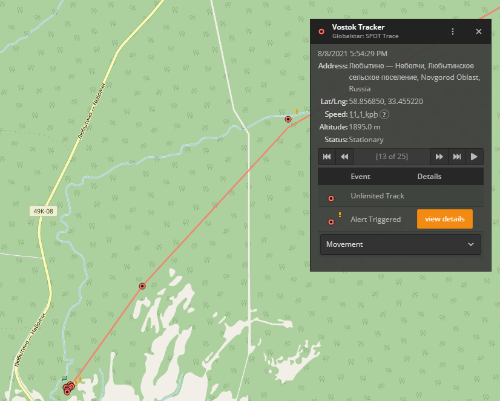

Нуштош, время еще не позднее, постоим, подождем. На этот раз ждали не долго - он снова прислал **Movement Stop**.

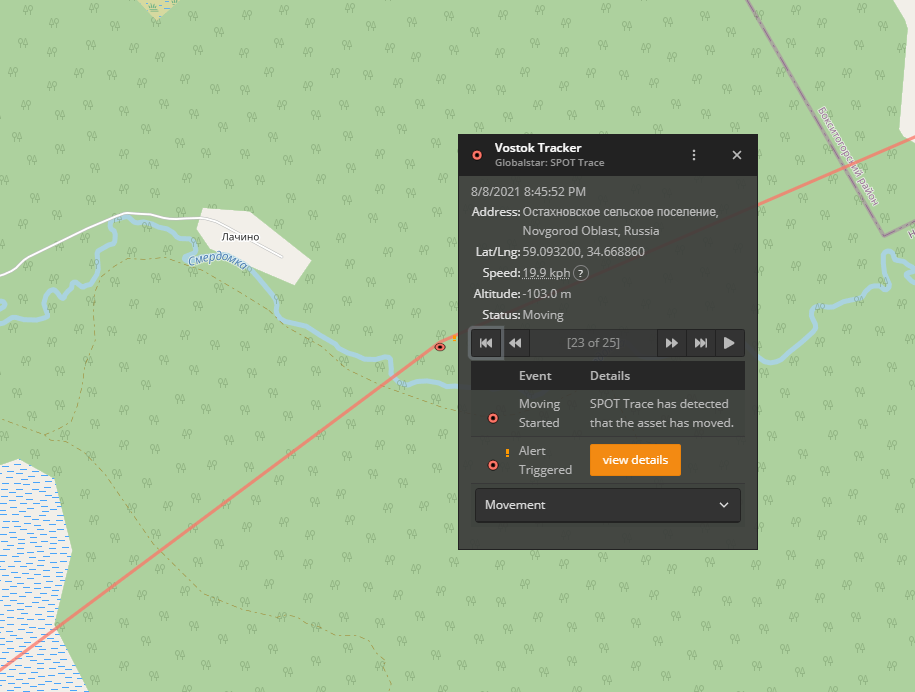

В этот раз подальше от трасс, но спутниковые снимки показывали наличие деревни неподалеку. Это обнадеживало. От нее какая-то сотня метров то ли по лесу, то ли по полю - там не ясно, но мы выдвинулись... Приехав на место уже в сумерках, мы выгрузились в месте, где дорога терялась, взяли снарягу и двинули пешком. Поплутав часик, стемнело окончательно, а перед нами маячила нехорошего вида лесополоса. Знаете, именно в этот момент я взял со всех обещание - больше **никогда не пытаться искать зонд в день запуска**. Это мертвая затея, поверьте. Запустили и езжайте домой отдыхать. Ничего с ним не будет, полежит недельку, другую - не испортится! Мы вернулись к машине и поехали домой. А зонд... Опять прислал движение...

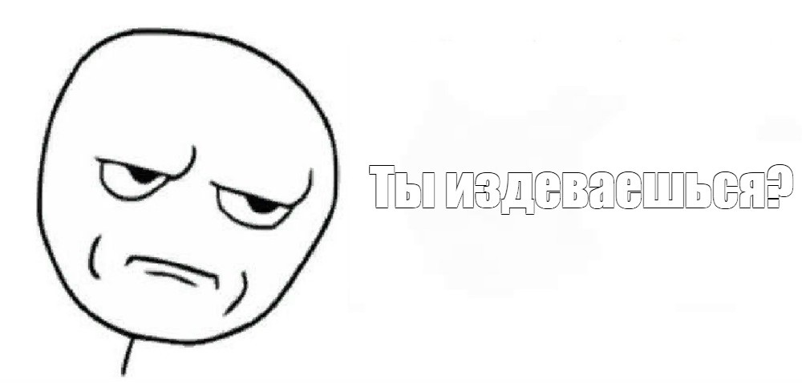

Но мы уже летели домой, строить планы на поиск и спасение через неделю. Окончательная точка падения была в 8км от того места, где мы плутали в день запуска. Местность, судя по всему, совершенно безлюдная, так что только если медведи унесут. А их мы потом тоже найдем, так что все ок.

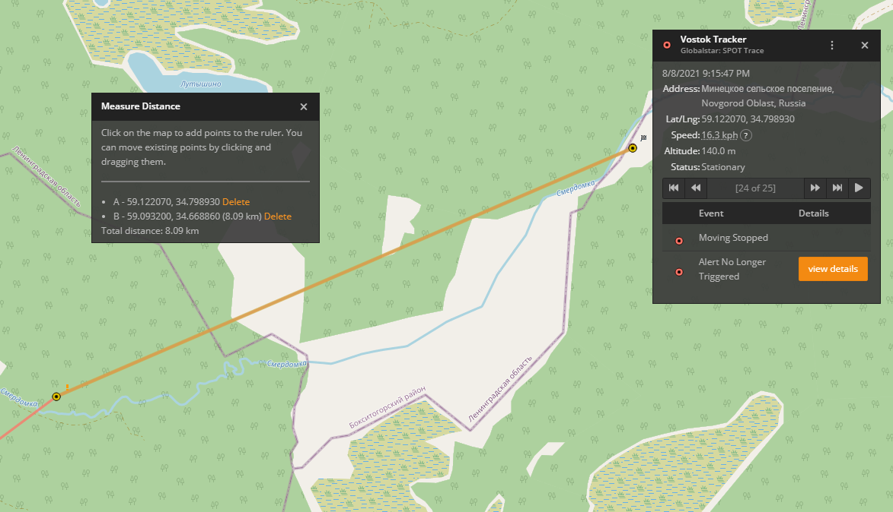

Итак, давайте осмотримся, что там, в этих координатах? Зонд лежит на берегу реки "Смердомка", ближайший райцентр - Смердомский. А ехать нам в пятницу 13го. Так себе знаки... Но желание получить данные с зонда сделало всех участников команды несуеверными, так что начали строить варианты подхода/подплыва/подлета к точке.

Главный конструктор полезной нагрузки выдвинул предложение: раз зонд на берегу речки - надо идти по речке. Сопротивляться никто не стал. Во-первых: он особо никого и не спрашивал, а во-вторых: ну было интересно на лодке покататься, чего уж там :)

Хорошо, вы уже видели в бухгалтерии расходы на аренду лодки с мотором - вот она. Проблема оказалась в другом - подобраться к этой речке с лодкой не так-то просто. Лодка с мотором весит прилично, а речка подходит к дороге в местах, расположенным довольно далеко от зонда. Значит если придется оттуда плыть - плыть придется далеко и долго. Мы накидали 3 маршрута.

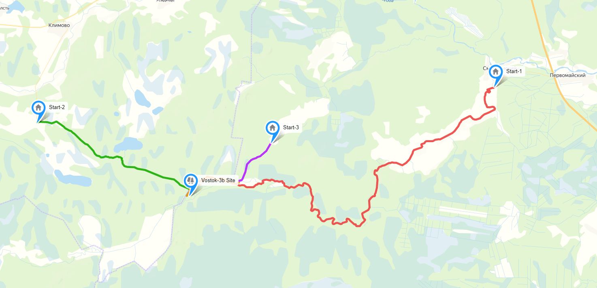

**Start-1**: доезжаем до поселка Смердомский, там спускаемся на воду и примерно 15км идем на лодке по реке. 15км это очень много для нас, но из плюсов - хороший подъезд к речке на машине (не надо тащить лодку с мотором на руках).

**Start-2**: доезжаем до поселка Турандино, оттуда... а оттуда не понятно. На каких-то картах там есть водные пути, на каких-то болота, на каких-то тропы. В общем - не ясно. Но по речке идти сильно меньше.

**Start-3**: Доезжаем до Пучнино (по официальной перепеси там проживало 8 человек несколько лет назад. Сейчас - неизвестно). Дальше дорога до реки становится просекой. При хорошей погоде просека должна быть проходимой для обычного седана. По реке идти всего 3.3км

Я считаю, что человек развивался сотни тысяч лет не для того чтобы страдать, так что мы выбрали самую простую (как нам тогда казалось) точку старта - точку **№3** (между собой мы называли ее "северная").

### День первый

Просека оказалась... лесовозной дорогой, созданной лесовозами для лосовозов. Отнюдь не для нашего авто. Тем не менее мы решили рискнуть и проехать по ней, тем более, что большие грязевые колдобины виднелись только в начале, далее шла приемлемая дорога. По странному стечению обстоятельств у меня не сохранилось ни фото, ни видео с демонстрацией этой местности (это мы потом спросим с нашего оператора), так что просто поверьте - она непроходима для легковых авто. Мы даже катались там по соседним полям в надежде найти объезд, несколько раз увязли в грязи, но все тщетно. В итоге мы *пропрыгали* примерно километр, полтора по лесовозной, еще немного проехали по относительно ровной поверхности и уперлись в совсем плохое покрытие. С этого момента всем стало ясно - дальше мы точно не поедем. Доставать нас оттуда будет некому в случае чего.

Вернулись обратно и поехали на точку **№2**. Она же - восточная. От нее долго по реке, но, зато нормальный подъезд прямо к берегу. Ну не зря же мы лодку с мотором перли?

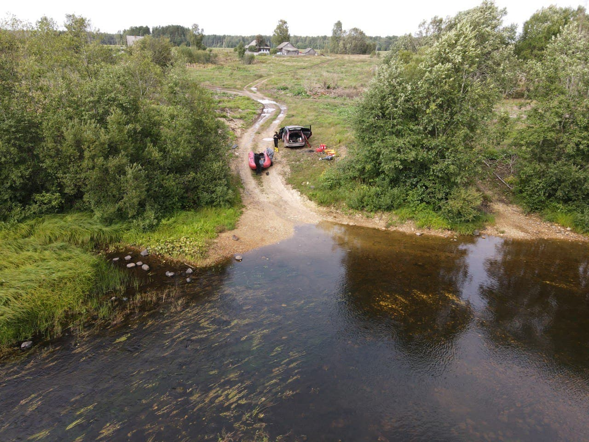

Мы так увлеклись идеей покататься на лодке, что даже не обратили внимания на саму речку. А это оказалась "речка Шредингера" - она вроде и есть, но ее вроде и нет.


Сильно позже мы узнали, что более-менее судоходной она, в лучшем случае, становится только весной. А в августе ее средняя глубина - полметра. Средняя. Да, это создает проблем для мотора, но у нас были и весла. А спустя метров 10-15 мы нашли проблему и для весел - пороги. Да, речушка оказалась очень порожистой, камни выступали над поверхностью воды. Это означало, что лодку придется через них перетаскивать. Дальше было 2 новости: хорошая и плохая. Хорошая: у нас был вот этот парень:

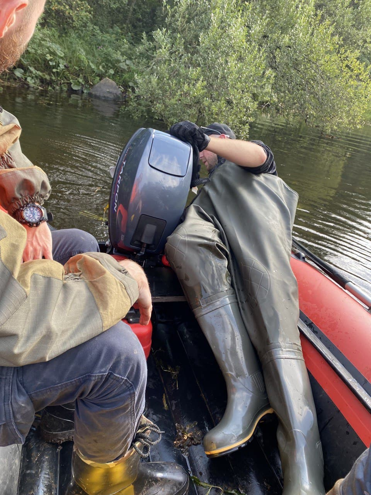

Он мог тащить лодку. Плохая новость - телепузы (сапоги по грудь) были только у него. Значит лодку ему предстояло тащить вместе с нами. На энтузиазме он проделывал это пару часов, но силы его заканчивались (а нам было нормально). Начали появляться предложения вернуться обратно, потому что мы прошли от силы всего метров 200, а предстояло пройти 15км. В пользу этого предложения послужил еще и тот факт, что с такой средней скоростью продвижения мы доберемся до точки как раз к весне, а там уже сможем пересесть на мотор.

[](https://youtu.be/ar_79_YR33Q "Vostok-3b. Вид на реку Смердомка.")

Ок, развернули лодку и пошли обратно. На обратном пути утопили GoPro, которую использовали для съемок этой экспедиции. Честно говоря, никому ее жалко не было, жалко было потерять материалы с нее. Но ребята вознамерились отомстить этой речке за камеру и вернуться за ней с:

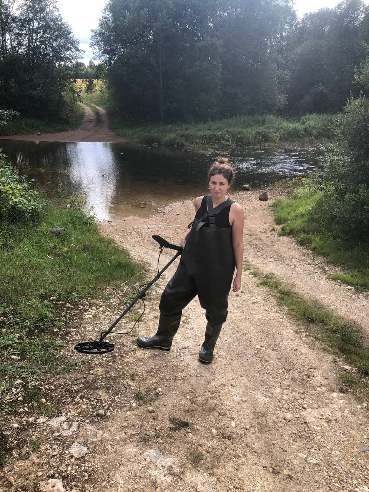

...металлоискателем. Это было в другой день и без меня, но:

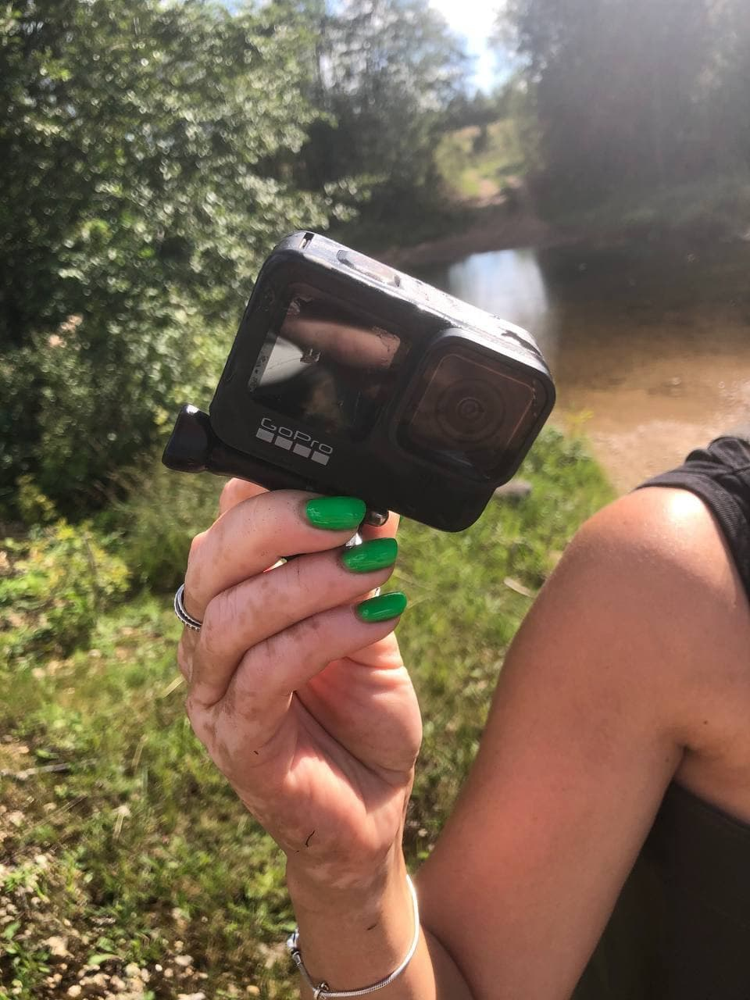

Они ее нашли!

> И небольшое отступление по материалам. Примерно в середине экспедиции, мне стало лень отписывать родственникам\друзьям как идут дела (там где появялалсь связь, но в 90% местности, где мы обитали - связи не было совсем! ни у кого!) и я решил записать селфи-видео с коротким рассказом: как прошла та или иная вылазка. Это неплохо развеселило ребят и мы решили и дальше так делать. В итоге у нас накопилось некоторое количество видеоматериала с поисков в формате репортажа-отчета. Но. У него нет начала и не установлен контекст (начал снимать то я практически с середины). Так что у меня это все хранится в виде набора разрозненных записей. Возможно, чуть позже, я смонтирую что-то из этого и досниму недостающий контекст, но пока я буду оставлять ссылки на отдельные видео - кто хочет смотрите, кто не хочет - игнорируйте :)

На точку **№2** (западную) никто особо ехать не хотел. Мы уже и так потратили много времени и сил на выяснения окружения точек №1 и №3, так что было принято решение попытать еще раз удачу на северной точке. Но теперь уже без машины. Напомню - подъезд к реке нам нужен был, чтобы не тащить на себе лодку с мотором. Теперь мы знали - никакой ~~ложки~~ речки нет! В худшем случае - снимаем обувь и переходим вброд. Такая идея понравилась всем, даже лодочному фанату.

Приехав к началу лесовозной дороги, мы сгрузились, взяли кому что надо и пошли - нас ожидали 5км пешего пути до речки. Прошли мы их довольно бодро, а в конце нас ждал сюрприз - через речку был мост. Ну как мост... бетонная плита. Но она работала как отличный мост. Это укрепило нашу мысль о том, что лодка в этом путешествии была лишней, так как этот "мост" - непреодолимая преграда для нашей лодки. Ладно, нет смысла сожалеть - мы только на середине пути и надо двигаться дальше. А дальше... дорога, даже лесовозная, закончилась. Совсем. Там было поле высокой травы (под 2 метра высотой), местами примятой под колею. Но колея эта точно оставлена не автомобилями. Мы предположили, что это могли быть охотники на вездеходах, тем более, что по пути мы видели несколько лабазов (специальные охотничьи укрепления, к которым загоняется зверь и оттуда по нему ведется огонь). Поле это то и дело пересекал бурелом, лес, овраги и т.п. В общем - недружелюбная среда. Еще эти лабазы... И в такой обстановке нам предстояло еще 5км пути. Время было вечернее. Посовещавшись, мы решили - никто не пойдет в этот лес/поле ночью. Даже если мы к полуночи придем на точку - надо будет еще дойти обратно. Слишком опасно. Но план - пробраться именно здесь, этой дорогой - выглядел хорошо. Так что мы решили заночевать неподалеку. Километрах в 20 проходило шоссе, а где шоссе - там и мотели. План "А" на этот счет был таким: едем ночуем в мотель, утром, пораньше, выдвигаемся на северную точку и снова: 5км по лесовозной + 5км по буреломам. На этом закончился наш первый день спасения Vostok-3b.

И вот короткое видео, где я рассказываю все то же самое:

[](https://youtu.be/rUi5HUdmGFU "Vostok-3b. Поисковый отчет 1.")

### День второй

Переночевав в сомнительного вида мотеле (где, к тому же, ночью у нас в номере прорвало трубу канализации), мы поднялись в 6 утра, в 7 позавтракали и выдвинулись на северную точку. План был надежный, как швейцарские часы - просто идем всю дорогу пешком, берем зонд и так же уходим. Ну что тут может сломаться?! Мы же полетали там на коптере и увидели вполне проходимое поле! Ну вот примерно такое:

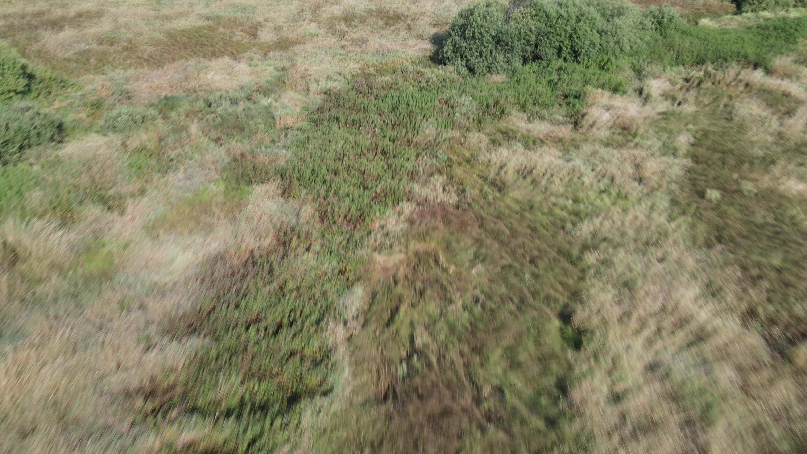

Наш план на начало второго дня:

[](https://youtu.be/IBcLPyc_dr4 "Vostok-3b. Спасение. Начало второго дня.")

Кадр из видео с квадрокоптера. Согласитесь - вполне нормально. Оказалось, что нет... Начиная от моста шла вездеходная колея, по которой мы и пошли. Вне колеи эта трава была высотой под 2 метра и она никому не нравилась по двум причинам. Во-первых: змеи. Во-вторых: кабаны. И те и те любят понежиться в травке, а, из-за ее размеров, видимость наша практически нулевая. Мы против убийства животных ради развлечений, но ружье у нас с собой было. Не от змей, конечно, от змей у нас были резиновые сапоги. Проблема заключалась в том, что кабаны спят в траве стаями. А в такой высокой траве увидеть их заблаговременно не получится. В итоге, любая встреча с ними была бы для нас неприятной неожиданностью. Тем не менее мы упорно топали по колее, пока не закончилась и она. А до места приземления еще оставалось километра полтора. Мы просто уперлись в сплошную стену 2х-метровой травы (потенциально с полчищами кабанов внутри). Как я уже говорил: ружье у нас с собой, но никто из нас не Рэмбо - одно дело если ты видишь угрозу и можешь приготовиться, другое дело, когда она возникает неожиданно. Это означало только одно - надо возвращаться и пробовать последнюю точку захода "западную". И уже в который раз мы вернулись по знакомой дороге к машине, загрузились и, сильно потеряв в энтузиазме, двинули к западной точке.

Видео отчет за этот период:

[](https://youtu.be/qz5QJxFj2YQ "Vostok-3b. Спасение. Середина второго дня.")

И вы не поверите :) По пути нам навстречу попался вот этот парень:

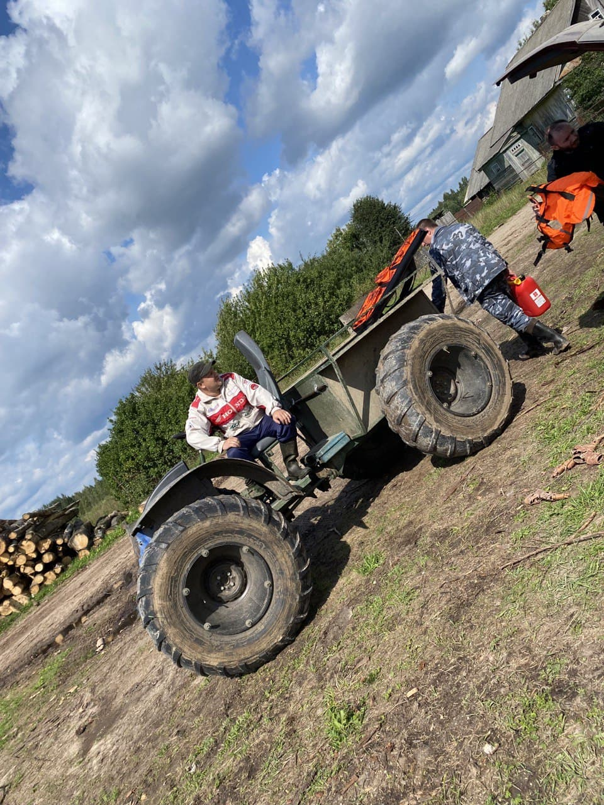

Про встречу вездехода:

[](https://youtu.be/0GsGPh_pE5s "Vostok-3b. Решение любых проблем.")

Это не просто вездеход. Это - решение абсолютно всех наших проблем! Я долго не мог поверить в такую удачу. Никто не мог. Но, тем не менее, за скромную плату мы арендовали это устройство вместе с водителем и двинулись снова на северную точку. На этот раз ни трава, ни овраги с человеческий рост, ни кабаны - не являлись для нас проблемой.

Пара видео с демонстрацией его возможностей:

[](https://youtu.be/dItubjO15pI "Vostok-3b. Вездеход")

[](https://youtu.be/uM2bAkdUOoI "Vostok-3b. Вездеход")

Мы даже подумывали этот вездеход прямо там и купить, учитывая что его стоимость нас приятно удивила (по сравнению с Питерскими ценами), но хозяин сказал, что ему нужнее. Нуштош...

Думаю уже стало ясно, что до зонда мы добрались легко и без проблем, на месте мы распили шампанского на радостях и так же, благополучно, вернулись к машине.

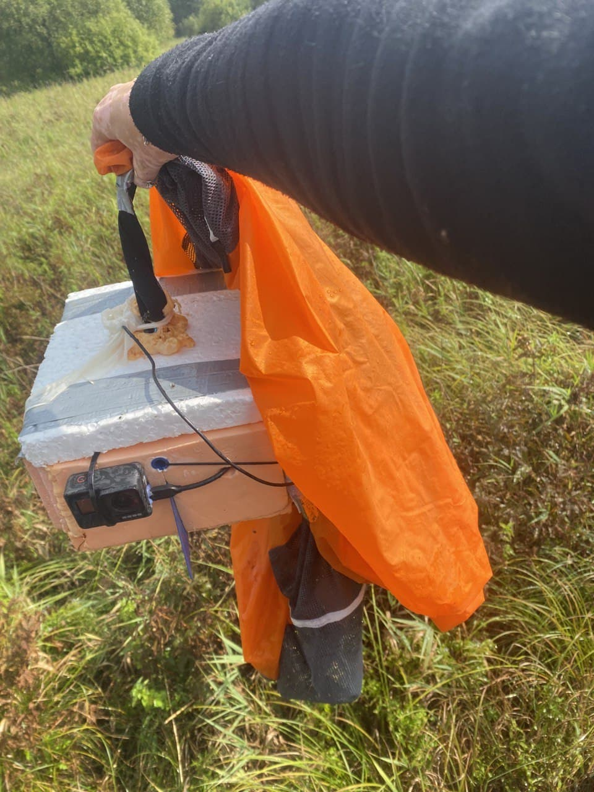

## Результаты

Начнем с главного.

### Высота

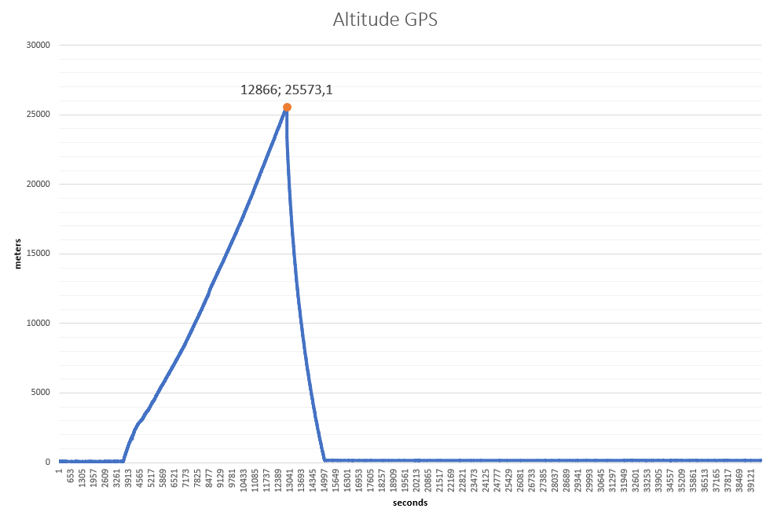

25,5 километров! Я нас категорически всех поздравляю - это **сильно лучше** чем у Vostok-1 (19км). Хочу обратить ваше внимание на то, что это шар L-300, с предельной расчетной высотой 21км. У нас он долетел даже выше, за счет того, что мы его недокачали на земле и сильно снизили массу полезной нагрузки. Так что шар качественный, рекомендую.

> Да, и в этот раз я не стал обрезать показания на графиках только до полетного сегмента. Так что тут и части с земли. Посмотрим, как зайдет.

И ложка дегтя: GoPro у нас снова отключилась сильно раньше ожидаемого. Примерно на 6.5км. Но на этот раз я не поленился и наложил телеметрию на видеоряд (уже в постпроцессинге, дома). Фото вы могли видеть в заголовке статьи, а теперь полное видео в 4k 30fps:

[](https://youtu.be/2Br3NdgLaaw "Vostok-3b. Full Flight")

Бонус-видео для инстаграмма:

[](https://youtu.be/1d9_1-PXZg0 "Vostok-3b. Flight. Directors Cut")

И оно нам всем сильно нравится, потому что тут есть проход облаков ;)

В качестве источников телеметрии выступали как сама GoPro (да, к 4-му году обладания этой камерой я вдруг узнал, что она тоже пишет телеметрию), так и наш RPI (для данных, которыми не обладает GoPro). Вот список показателей и источники:

| Показатель | Источник |
|-----|-------------------|
| Высота | GoPro 7 black |
| Вращение | GoPro 7 black |
| Скорость (3D) | GoPro 7 black |
| Маршрут GPS | GoPro 7 black |
| Дистанция | GoPro 7 black |
| Компас | GoPro 7 black |
| Акселерометер | GoPro 7 black |
| Давление | RPI Sense Hat |
| Влажность (внутри) | RPI Sense Hat |
| Температура внутри | RPI Sense Hat |
| Температура снаружи | TEMPer Gold USB Temperature Sensor |

Для видео я решил преимущественно использовать показания с самой камеры, ну потому что они нам показались надежней, да и синхронизировать их не надо.

### Влажность

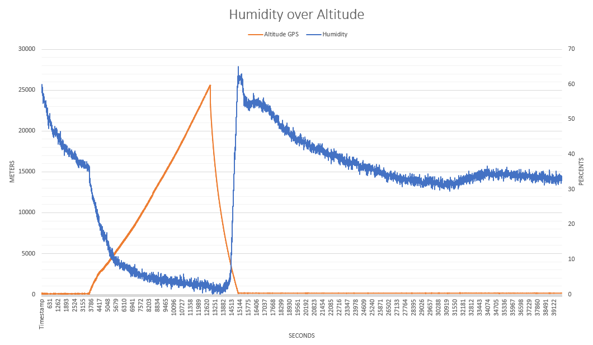

Честно говоря, увидев облака, я расчитывал на другую картинку. Ну, логично предположить, что в облаках влажность сильно выше? Вроде логично. Но тут мы видим что-то другое: влажность всегда падает с высотой. Даже там где облака. У меня есть теория на этот счет:

1. датчик влажности внутри бокса, а он закрыт.
2. размеры бокса мы сильно уменьшили (и его внутренний объем уменьшился).

Учитывая эти два факта, я могу предположить, что RPI просто испарял влагу вокруг себя, тем самым ломая нам показания. Эта теория слегка подтверждается показаниями внутреннего термометра - температура росла сильнее, чем у Vostok-1.

> Ну а скачок в конце - это дождик пошел уже на земле. Бокс неплохо затопило, не по крышку, конечно, но когда мы его подняли из него вытекло пару литров воды.

### Температура внутри

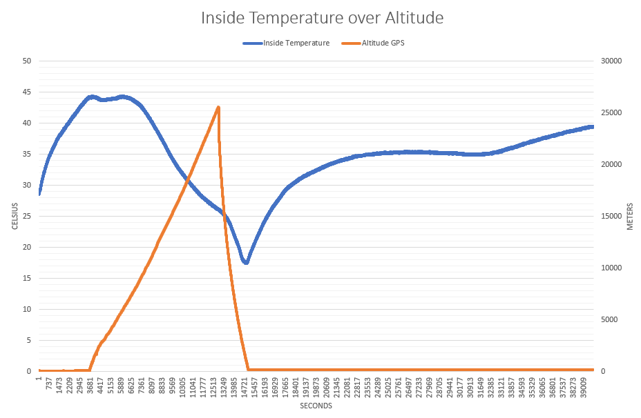

Это Vostko-3b. Пока лежал на земле, и немного поднялся - температура скакнула на 15 градусов по Цельсию! В отличие от:


Vostok-1. Где разница температур (правда не учитывая лежания на земле) составила всего 5-6 градусов по Цельсию.

Тем не менее, наш климат-контроль удерживал RPI и павербанки в диапазоне рабочих температур. Так что свою функцию он выполнил на все 100.

### Температура снаружи

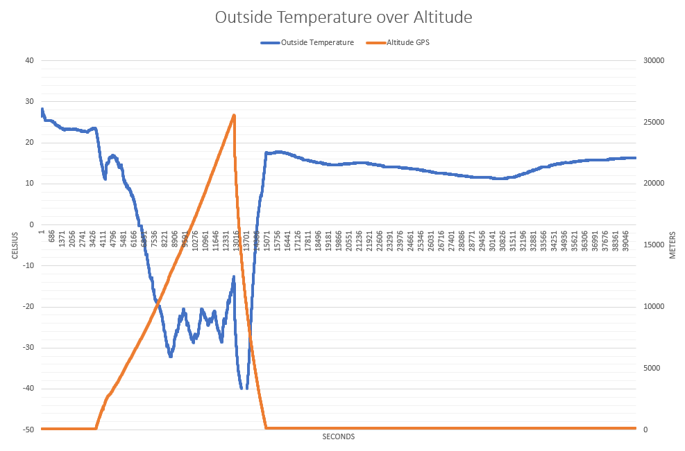

Тут никаких откровений: чем выше - тем холоднее. Видим некоторые флуктуации на высоте, которые мы видели и у Vostok-1. Видим все тот же провал после -50 - наш градусник ниже не умеет. Все ожидаемо.

### Давление

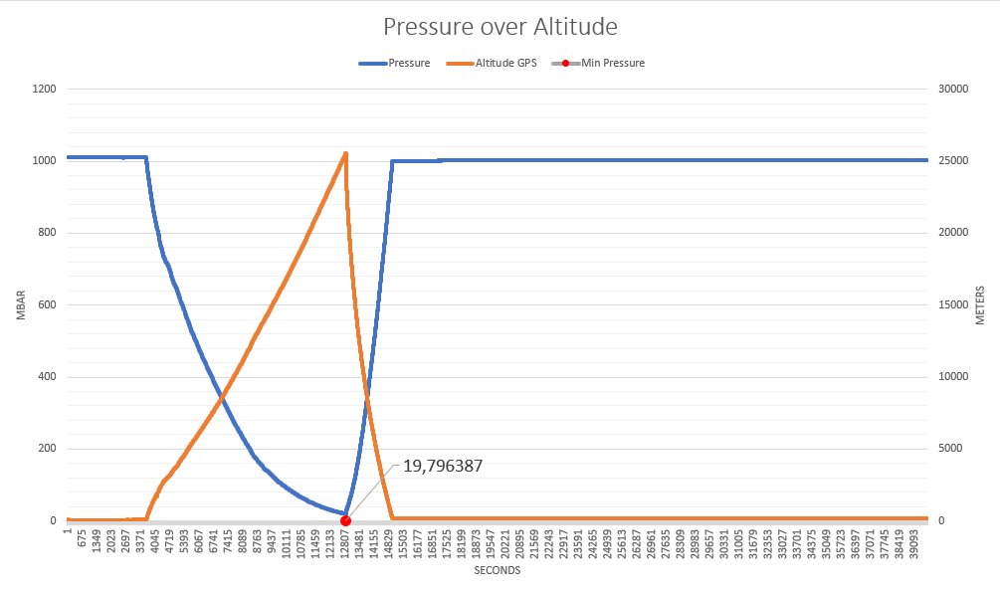

А вот тут разница с Vostok-1 есть. Хоть и ожидаемая: раз мы поднялись повыше, то и давление там поменьше. Vostok-3b зафисксировал минимальное давление в 19.8mbar. Если что, то это 1/50 часть атмосферы. Напомню результат Vostok-1:


58mbar. Почти втрое выше, чем у Vostok-3b и все еще экстремально низко для людей :)

### Вращение

Этого показателя раньше не было, но я его добавлю для обоих аппаратов, т.к. мы добавили боковые стабилизаторы и хотелось бы понять - имеют они смысл или нет?

Вращение Vostok-1:

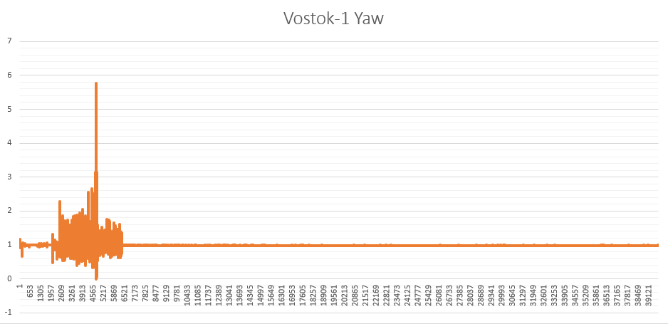

Вращение Vostok-3b:

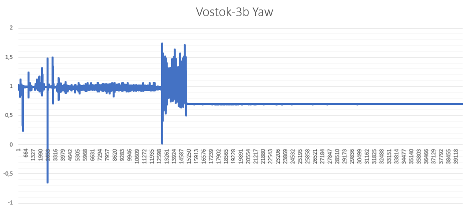

Хм. Ну, мне сложно сказать что-то однозначно. Могу лишь сказать - амплитуда колебаний со стабилиаторами меньше. Что нам это дает? Я не особо понимаю, если честно. Ну да, крутит поменьше, но и в первый раз вполне можно было разобрать пейзаж. Т.е. разница до/после не такая критичная. Да и не факт, что это эффект от стабилизаторов: может просто погода менее ветренная была?

Если у кого-то есть мысли на этот счет - просьба отписать в комментариях. Я добавлю/поправлю.

### Время

Время в этот раз для нас было важно, так как мы поменяли источнки питания для всех систем на павербанки вдвое меньшей емкости. И хотелось бы понять - можем мы их еще *подрезать* или уже все. Сравнивать конечно будем Vostok-1 и Vostok-3b. Напомню, оба шара в этих аппаратах были L-300: массой 300г и с предельной высотой 21км. Первый достиг 19км, второй 25,5км. Vostok-1 имел каждый powerbank емкостью 20000mAh, Vostok-3b - 10000mAh. GoPro сейчас в расчет не берем, т.к. она, по моему мнению, выключалась не от истощения внешнего павербанка.

| | Vostok-1 | Vostok-3b |
|---|-----|-------------------|
| Время функционирования RPI | 25:51:48 | 11:26:42 |
| Время полета | 1:02:53 | 3:17:15 |

Ну что же. Определенно зависимость между емкостью аккумуляторов и временем жизни телеметрического модуля есть. Но мы видим - время жизни Vostok-3b все еще сильно больше его времени полета. Значит есть куда уменьшать емкость, а значит - можно сделать полезную нагрузку еще меньше (даже с учетом того, что оставшиеся 4.5км до целевой высоты зонд будет подниматься еще пару часов). Но резать советую только аккумулятор для RPI, GoPro была проверена на земле и 10000mAh ей хватает впритык.

### GPS

Тоже нечто новое. На этот раз я захотел проследить весь полет зонда по карте и решил построить трек по показаниям бортовой GPS HAT. Я построил. И перестроил. И все равно был недоволен. Вот что оно мне показывало:

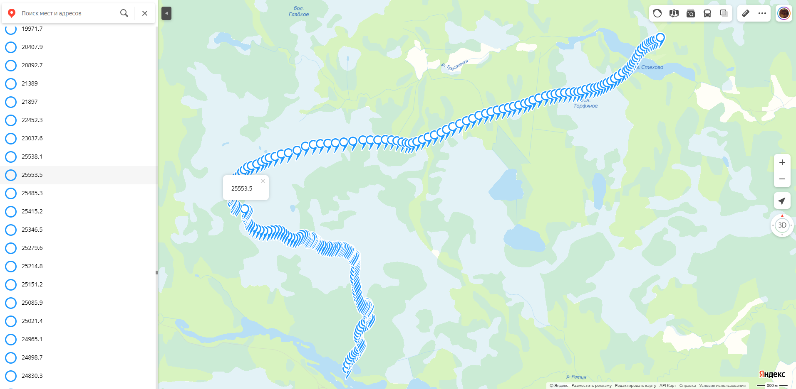

На самом деле, там таких сегментов (схожей формы) несколько. Этот конкретно последний по времени. Я его привел для сравнения мест посадки. Помимо того, что между сегментами значительные разрывы, там пара точек еще как-то оказалась в тихом океане.

А вот трек с поискового трекера:

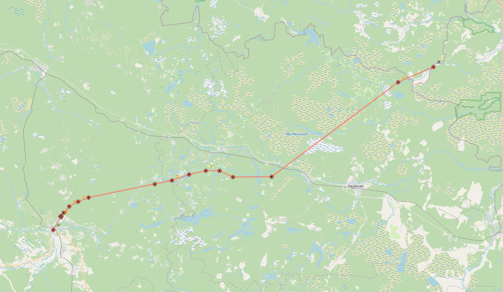

Основная проблема - сильно разные конечные точки. Вот эта разница на карте:

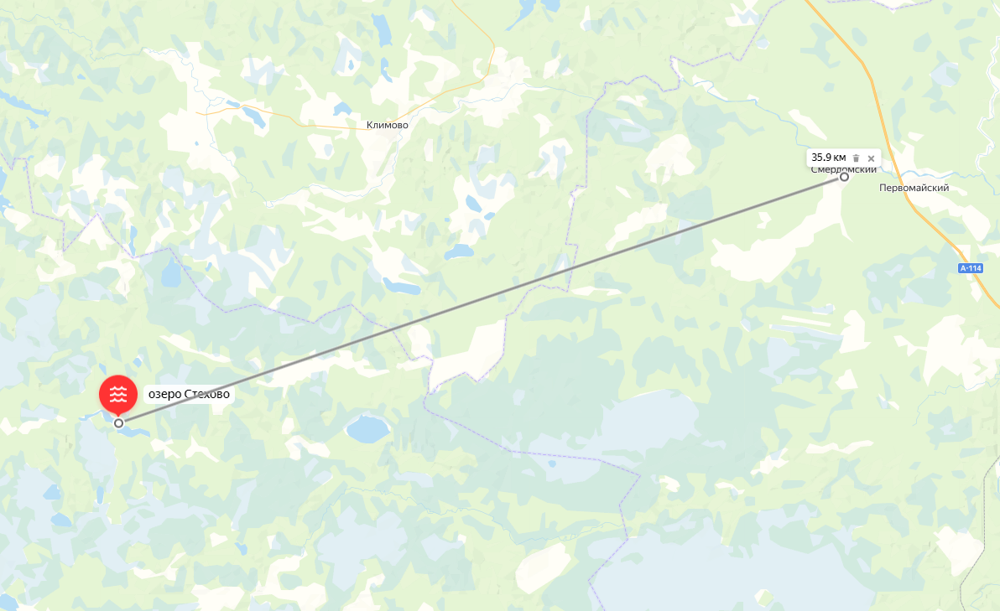

Нет, я понечно не исключаю, что где-то в недрах документации можно раскопать способ калибровки и/или компенсации погрешности, но **сорок километров**?

Это еще раз говорит о том, что если кто-то вздумает, что можно сэкономить на трекере и использовать *что-то попроще* - не надо. Вы потом никогда его не найдете. Вдобавок не забывайте - GSM связи там нет. Совсем! Если вы выберете трекер, который передает координаты по GSM - вы его никогда не найдете.

Так же добавлю упущенный в прошлый раз момент - точность прогноза траектории. Хорошая. Вот что у нас было предсказано (синяя стрелка указывает на реальную зону посадки):

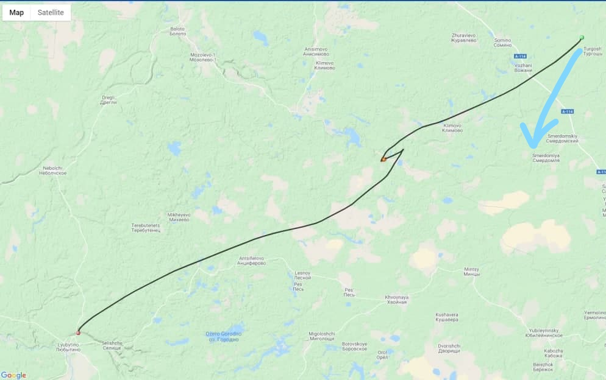

Учтите что мы строили маршрут с условием подъема до высоты 30км, до которой мы немного недобрались.

Как и в прошлый раз оставляю ссылки на полную телеметрию:

[Оригинал](https://github.com/ArtemKiyashko/ProbeLoggerArticle2/raw/master/telemetry/08082021.csv)

[Мои изыскания](https://github.com/ArtemKiyashko/ProbeLoggerArticle2/raw/master/telemetry/08082021.xlsx)

На этом с результатами закончим. Подведем короткие выводы и пофантазируем о будущем.

## Выводы

На самом деле все хорошо, несмотря на то, что мы потеряли основной для 3го запуска шар (Vostok-3a). Vostok-3b превзошел наши ожидания. Но снова подвела камера... На ее счет у меня тоже есть предположение: помните в первой части я обещал, что мы больше не будем оставлять в ней внутренний аккумулятор и запитаем только от внешнего? Мы этого не сделали. Не сделали потому, что побоялись, что 10000mAh может не хватить и оставили и внутренний, и внешний аккумуляторы. И вот, как по моему мнению, развивались события:

1. Включили камеру
2. Включили запись
3. Включили powerbank
4. Произвели неудачный запуск Vostok-3a
5. Выключили камеру (или запись)
6. Павербанк полносьтю зарядил камеру в этот момент и отключился
7. Перемонтировали нагрузку на новый шар
8. Включили камеру (или запись)
9. Камера питалась только от внутреннего аккумулятора, т.к. павербанк уже был отключен

Видите? Внутренний аккумулятор сыграл с нами плохую шутку - если бы его не было, мы могли бы по внешним факторам (красный огонек на фронтальной стороне) понять - идет запись или нет. А так получилочь, что запись идет всегда - только мы не понимаем от чего. Ну и в суматохе не перепроверили: включен ли павербанк. В подверждение этому, выступает тот факт, что когда мы нашли и открыли бокс - банка для GoPro была почти полная (а для RPI, соответственно, пустая). Ок это учтем на будущее (снова).

Немного про будущее. 30км мы так и не достигли - значит продолжаем. Но продолжать зимой - тяжело. Особенно по части поиска и спасения. Так что мы попробуем сделать еще 1 запуск в этом году и, скорее всего, уйдем на каникулы. Запускать попробуем шар L-2000 производства китайских кутюрье. Также, у нас серьезно укрепилась мысль, что нам надо купить тот вездеход. Ну может не тот именно, но такой же. Проведя 2 успешных поиска, мы поняли - нас всегда выручал именно вездеход. Так почему бы не заиметь его себе?

На время каникул я вынашиваю идею все же осилить владение паяльником и переделать *черный ящик* на Arduino. Это сильно снизит массу и тепловыделение этой подсистемы. Ну а этот год долетаем на RPI.

Как вы понимаете, даже если следующий запуск будет успешным и (вдруг!) мы достигнем 30км и по высоте и по видео - писать будет особо нечего. Ну, запуск и спасение останутся, да. Но никаких технических изменений нигде больше не планируется. Так что я пока не уверен - будет ли статья на этот счет или все ограничится нашими инстаграммами. Если есть предложения\пожелания на этот счет - пишите, почитаем.

На этом все. Fly safe, cmdr!
