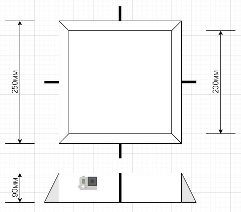

# Самодельный стратостат. Часть 2


Long, long time ago... Нет, не так. 4 месяца назад я рассказал вам, как из клея и резиновых сапог создать с нуля свой стратостат с телеметрическим модулем и видеокамерой. Я так же описал наш опыт запуска и поиска этого метеозонда, обозначив несколько возникших проблем. Что ж. Мы анализировали, анализировали и доанализировались до четвертого шара. И сейчас я расскажу вам, что произошло за это время, почему он четвертый, и где *пропавшие* два. Эта часть будет менее технической, т.к. изменений конструкции *почти* не было, но те что были - имеют значение. Если вы вне контекста, то эту часть советую читать только после прочтения первой (хотя бы технических разделов). Ссылка на первую часть ниже. Будет много фото, видео и графиков. Поехали?
## Вступление

[Самодельный стратостат. Часть 1](https://habr.com/ru/post/555070/)

Кратко напомню, что тут происходит и что будет происходить дальше. Давненько уже (больше года назад) задумали мы с друзьями собрать с нуля и запустить (а потом и найти/достать) свой стратостат. Полных инструкций в интеренете оказалось не много, по-этому появилась первая часть этой статьи. Как и любой проект - этот проект должен иметь финал. А чтобы иметь финал - нужно иметь конкретные цели проекта. Из целей были выделены две: достичь высоты 30км и получить видео в 4k с высоты 30км. Ни одна из целей не была достигнута в первом запуске (напомню, там было: 19км и видео до 7км), так что проект продолжил развиваться.

Давайте сначала я опишу *naming convention*, чтобы не путаться дальше в истории. Я разделяю 2 сущности: запуск и шар. Сделано это потому, что в один запуск мы можем запустить (поправить бы тавтологию) несколько шаров. А нам нужна адресация до конктретного запуска-шара. Итак. Первый наш шар носил название **Vostok-1** - первый запуск, единственный шар. За ним был **Vostok-2** - второй запуск, единственный шар. Далее **Vostok-3a и Vostok-3b** - 3й запуск, два шара. Vostok-2 и Vostok-3a потерпели крушение на старте.

### Vostok-2

Первой нашей проблемой была высота. И с ней так же связан неудачный запуск второго шара. Высоту мы решили победить увеличением объема шара. Был выбран шар **L-800** (800 это масса шара в граммах, таблица ниже). А если больше шар, то и гелия надо больше, правильно? Правильно. Но мы совершили ужасную ошибку и тут и с Vostok-1: за целевой объем шара мы приняли не ту величину. Мы их сильно перекачивали. Vostok-1 улетел чудом, Vostok-2 не выдержал такого издевательства и *сошел с рельс* на старте. Давайте разберемся где я накосячил в оба запуска.


Вот технические характеристики шаров. Vostok-1 имел шар **L-300**. Вроде все ясно, только одно мне было не ясно: в чем разница между *начальным* и *рабочим* диаметрами. Я, почему-то, подумал, что если есть слово "гелий" - значит нам туда. Оказалось, что нет. Рабочий диаметр, это некое усредненное значение *на высоте*. А нам надо было использовать начальный диаметр как цель для наших расчетов. Давайте посчитаем количество гелия для этих шаров и разных диаметров по формуле из первой статьи:

| Шар | Начальный диаметр (баллонов по 40л) | Рабочий диаметр (баллонов по 40л) |
|-----|-------------------|-----------------|
| L-300 | 0.29 | 0.70 |
| L-800 | 1.72 | 3.43 |

В обоих случаях разница значительная. Уже на старте мы перекачали шар почти вдвое! Но, т.к. мы докачивали шар до его рабочего диаметра - он не взрывался (этот же диаметр - рабочий!). Проблема оказалась в подъемной силе. Во втором случае она очень, очень значительная. Пока ребята накачивали его, им пришлось буквально висеть на нем вдвоем и третий подстраховывал. Это создало значительную нагрузку на горловину шара, за которую его и держали. И, невыдержав растяжения, горловина порвалась, унеся в небо 50000 рублей. От такого количества гелия местные птицы еще 3 дня орали смешным голосом.

[](https://youtu.be/PQXxAPXEx18 "Vostok-2 Fail")

Итак, осознав свою ошибку, мы получили серьезное преимущество - теперь мы знали, что гелия нам надо вдвое меньше. А гелий и, непосредственно, шар - это единственные невозвратные ресурсы наших запусков. Иначе говоря - мы сильно снизили стоимость запуска.

### Vostok-3a

Это был шар L-600. Мы закачали правильное количество гелия. И даже немного подстраховались (как мы тогда думали), используя тент для удержания шара в процессе накачки, чтобы не создавать нагрузку на горловину. Подвела нас анатомическая аномалия всех членов команды (проще говоря - руки из ж...). И этот шар успешно улетел в ветки деревьев, об которые и взорвался.

[](https://youtu.be/dokYBQEhyGc "Vostok-3a Fail")

Выдержав минуту молчания, мы вспомнили, что когда-то давно то мы заказывали 2 шара L-300. Как раз на случай неудачи. И сейчас был именно такой случай. Так как гелия мы всегда берем немного с запасом (мало ли стравит где или еще чего), то немного у нас еще оставалось. Да и шар этот был почти вдвое меньше, так что и гелия надо было сильно меньше. Закачав остатки в 300-й шар мы, уже особо ни на что не расчитывая, просто отпустили его в небо без долгих прощаний. Это был наш **Vostok-3b**. Об этом запуске и пойдет речь в этой статье, т.к. он оказался успешным!

## Список оборудования и компонентов

На самом деле, оборудования, в сумме, докупалось прилично. Но тут я не буду перечислять все купленное, а сосредоточусь только на том, что реально улетело на Vostok-3b.

> Некоторые будут выглядеть как: ничего не изменилось, идем дальше. Я оставил структуру статьи как в первой части *для обратной совместимости*

Состав полезной нагрузки почти не подвергся изменениям: это все та же RPI 4B (+Sense HAT + GPS HAT) + GoPro 7 black.

Добавлю только пару фото компонентов черного ящика (ранее их не было), так как я забирал его домой для ремонта, который не пригодился, но об этом упомяну чуть детальней в части спасения:


Помимо увеличения объема шара, для достижения расчетной высоты мы решили так же экономить и вес полезной нагрузки. Проанализировав массу компонентов, мы поняли, что можем хорошо сэкономить на аккумуляторах (павербанках). В первый запуск это было 2 повербанка по 20000 mAh, каждый массой ~300г. Взглянув на телеметрию Vostok-1, мы поняли, что бОльшую часть времени наш зонд работал на земле, соответственно таких емкостей (как минимум для RPI) - нам не надо. И решили порезать емкость банок вдвое. Обеих. Взяли 2 павербанка 10000 mah с массой 180г каждый. И не прогадали, экономия массы ощутимая, емкости хватило на обе подсистемы и даже немного с запасом.

Ну и мы не стали в этот раз класть бутылку виски :)

По оборудованию это все. Переходим к облегчению конструкции.

## Конструкция

Далее мы решили переделать корпус. Корпус первого востока был слишком большой для наших нужд и это было нерационально - пенополистерол тоже имеет вес. Мы так же пробовали различные материалы, в частности, пенопласт.


Но, несмотря на значительную экономию массы - пенопласт не подходил по ряду причин. Например, он был слишком хрупким и мог развалиться от нагрузки создаваемой подъемной силой шара. В итоге мы откатились до пенополистирола, но срезали ему лишнюю *крышу*:


Размеры нового бокса:



### Общая конструкция

Схема та же, что и с Vostok-1. Единственное что мы добавили (по совету из комментариев на YouTube) - боковые стабилизаторы. Помогли они или нет - сложно судить. Забегая вперед скажу: судя по телеметрии и даже видео - да, крутило меньше чем в первый раз. Но и условия полета были другие. Так что тут мне сложно судить о целесообразности этого решения в нашей задаче. И, несмотря на то, что стабилизаторы увеличат массу - мы все же решили рискнуть и приклеили пластиковые треугольники по бокам:


Это вид бокса уже после того, как мы его нашли (и сняли верхнюю крышку). Фотки *до* я, почему-то, не смог найти. Но суть стабилизаторов это передает.

Да, и, как видите - GoPro на этот раз мы решили закрепить целиком снаружи на пластиковые стяжки, продетые сквозь корпус. Во избежание перегрева в стенках бокса.

### Полезная нагрузка

Как я уже упоминал, заменили только павербанки. Так же, решили немного перекомпоновать компоненты в соответствии с новыми размерами бокса. Но смысл остался тот же: внизу грелка (RPI), над ней аккумуляторы обогреваемые RPI, по бокам сопла для поступления забортного воздуха для охлаждения RPI. Эти сопла так же используются для крепления бокса к парашютному фалу. Не буду вставлять схему охлаждения, т.к. это точно та же система, что и в Vostok-1. Она хорошо себя показала в тот запуск и мы решили ничего не ломать:


Приклеили так же несколько пенопластовых балок для фиксации компонентов нагрузки:


Итак. Что же нам это дало? Напомню, что Vostok-1 имел массу полезной нагрузки **2.5кг**. После проведенных манипуляций, нам удалось снизить ее вдвое - **1375г**:


Посчитав себя хорошими мальчиками, мы закончили с нагрузкой и двинулись дальше.

## Программирование

Ничего не менялось перед полетом. Все [тот же софт на dotnet](https://github.com/ArtemKiyashko/RpiProbeLogger) полетел, прилетел и доставил нам всю телеметрию.

Но вот после полета был небольшой рефакторинг. Дело в том, что в этот раз наш зонд очень сильно промок. Когда мы его нашли и я поднял его с земли - из него вылилось ведро воды. Карта памяти не пострадала, но вот телеметрический модуль заводиться больше не хотел. LED матрица вела себя странно - то включалась, то нет. Так что вез хирургического вмешательства было не установить: что конкретно отлетело?. Я взял модуль домой и, поочередно снимая платы, выяснил что проблема где-то в SenseHAT. Подебажив свой код немного, выяснилось, что выбрасывается исключение именно на обращении к LED матрице, вот тут:

```csharp
private void Show()
{
    var pixels = new Pixels(ImmutableList.CreateRange(_currentStatuses));
    LedMatrix.SetPixels(pixels); // Тут было исключение
}
```

Это часть класса `StatusReportService`, который не имеет интерфейса и, чтобы понять: а все остальное работает ок или не ок - нужно было заэкстрактить интерфейс и за mock-ать этот сервис. Что и было проделано в [единственном коммите](https://github.com/ArtemKiyashko/RpiProbeLogger/commit/eccc7a65c0f225054560b6e840590d799da78cf8).

Как оказалось - все остально работает штатно. А как оказалось после еще одной перезагрузки - LED матрица тоже заработала штатно ¯\\_(ツ)_/¯

Нуштош. Хорошо, что все хорошо закончилось. Пролистываем.

## Бухгалтерия

Уффф... Тут все сложно, но есть и хорошие новости. Как вы помните, первый запуск влетел нам в копеечку - примерно 80000р (из которых реально полетело 75000р) без учета стоимости GoPro 7 black (т.к. она на тот момент у меня уже была и не входила в расходы этого проекта). На GoPro накиньте еще 35000, итого 115000р на первый запуск. Но, там же я отметил, что при оптимистичном развитии событий - из невозвратного у нас только гелий и шар. Все остальное возвращается, находится и запускается снова. При пессимистичном развитии (не нашли, не смогли достать зонд) - конечно все придется покупать заново. Но мы нашли :) Так что бОльшую часть расходов заняли именно гелий и шар, и, как я упоминал в начале статьи - необходимое количество гелия мы так же сократили вдвое (благодаря исправлению ошибки в расчетах). Так что запуски наши серьезно подешевели, хотя и пришлось докупать всякое по мелочи. Давайте посмотрим на такую же, как и в первой статье, таблицу, но для Vostok-3a - Vostko-3b:


- Зеленый сектор - то что реально полетело в 3й запуск
- Желтый сектор - было куплено, но можно было бы обойтись и без этого
- Красный сектор - было куплено, но в этот запуск не пригодилось (можно было не покупать)

Как видите - в этот раз намного скромней. Львиную долю составляют именно гелий и шары. Шар L-2000 (царь-шар, массой 2кг) не успели доставить к нужной дате, так что вместо него полетели L-600 и L-300. L-300 был куплен еще к первому запуску и в эти расходы не входит.

Вооот, вот с такими ценами - запускам быть! Ну, если тут все ясно - двигаемся дальше.

## Подготовка к запуску

Тоже никаких откровений, по сравнению с первым запуском. Но мы решили не запускать из того же места по 2м причинам:

1. Ребятам очень не понраилось прошлое болото (да и аренда вездехода дело не дешевое)
2. Хотелось разнообразить приключения

Так что мы снова отправились на [fpln.ru](https://fpln.ru/) смотреть - где не летают самолеты и нет никаких закрытых/бесполетных зон. Затем сходили на [predict.habhub.org](http://predict.habhub.org/) прикинуть - куда должен упасть наш зонд из той или иной точки запуска (желательно, чтобы падал подальше от болот). Ну и, поголосовав немного, выбрали одну. Все как в первый запуск - едем дальше.


## Запуск

Вы, наверное, обратили внимание на закуп перчаток и материала для тента? Рассказываю :)

Сначала про перчатки. Начитавшись инструкции к шарам, мы обнаружили, что, во избижание повреждения оболочки, рекомендуется не прикасаться к шару голыми руками - жир может негативно сказаться на характеристиках латекса. Там же рекомендуется использовать х/б перчатки. Ну ок, взяли перчатки.

Тент. Помните видео крушения Vostok-2? Чтобы снизить нагрузку на горловину во время надува шара, было принято решение *поднадуть* шар под тентом, а потом уже фиксировать его положение исключительно тентом, не держать за горловину. Как-то так:


Так и сделали, но... вы помните видео крушения Vostok-3a? :) Честно говоря, еще когда я увидел этот тент, закрались в мою голову сомнения насчет целесообразности и его и перчаток. Ну какие перчатки, если у нас тент из мешковины с гвоздями? Сие сомнение было озвучено, но демократия страшная сила и мой голос был отклонен - все в перчатках, кроме шара. Шар в тенте. Крушение конечно произошло не по причине грубого материала тента или каких-то не тех перчаток, но результат вы видели.


Перейдем к хорошим новостям. Потеряв L-800, мы вспомнили про запасной L-300. За пару минут перемонтировали нагрузку к нему, закачали остатки гелия (а это было чуть меньше нужного количества) и отпустили ни на что особо не расчитывая. Но он взлетел плавно и ровно!

[](https://youtu.be/qgj9yKW4hng "Успешный запуск Vostok-3b")

Vostok-3b успешно стартовал и, по опыту первого запуска, мы собрались и двинули домой. Искать нам его предстояло минимум на следующий день, а то и на следующей неделе (все же по будням люди заняты на работах).

## Поиск и спасение

[//]: # (дофига всего и видосы)

## Результаты

[//]: # (как и в прошлый раз + анализ вращения. стабилизаторы, ало? + сравнение чего-то общего)

## Выводы

[//]: # (чо с камерой???)
